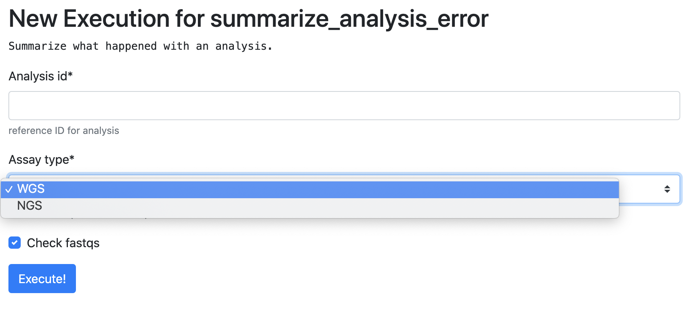
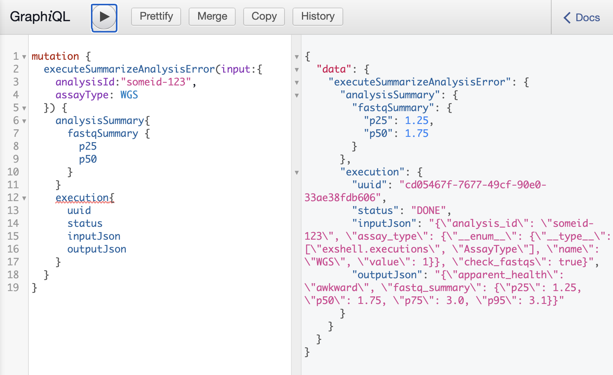
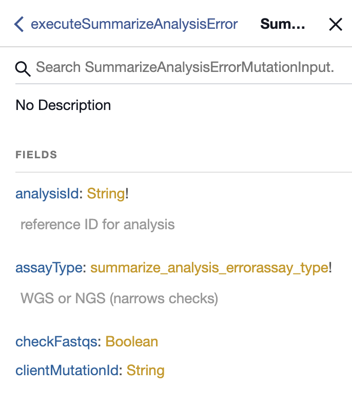

Django Turtle Shell
===================

NOTE: This is still in active development! Implementations and everything may
change!

How does it work?
-----------------


This lil' old library converts _your_ function with annotations into a ✨Django Form✨ and a graphql view.

It leverages some neat features of defopt under the hood so that a function like this:

.. code-block:: python

    import turtle_shell
    from pydantic import BaseModel
    import enum

    class FileSizeSummary(BaseModel):
        p25: float
        p50: float
        p75: float
        p95: float

    class AnalysisSummary(BaseModel):
        apparent_health: str
        fastq_summary: FileSizeSummary

    class AssayType(enum.Enum):
        WGS = enum.auto()
        NGS = enum.auto()


    def summarize_analysis_error(
        analysis_id: str,
        assay_type: AssayType,
        check_fastqs: bool=True,
    ) -> AnalysisSummary:
    """Summarize what happened with an analysis.

    Args:
        analysis_id: reference ID for analysis
        assay_type: WGS or NGS (narrows checks)
        check_fastqs: if True, look at 'em
    """
    ...

    turtle_shell.get_registry().add(summarize_analysis_error)


Becomes this awesome form, generated from type annotations!! (note how
we also use defopt under the hood to assign docstring elements to parameters)



Make your output pydantic models (as shown above) and get nicely structured
GraphQL output AND nice tables of data on the page :)



And finally even pushes docs into GraphQL schema



If you specify pydantic models as output, you'll even get a nice HTML rendering + structured types in GraphQL!

Installation
------------

First install it:

```
pip install git@github.com:jtratner/django-turtle-shell.git
```

Next, you'll need to add some stuff to INSTALLED_APPS::

    INSTALLED_APPS = [
        ...
        "turtle_shell"
        ...
    ]

 Next run migrations::

    python manage.py migrate

Then in an ``executions.py`` file you can set up your own functions (or
register external ones)::

    import turtle_shell

    Registry = turtle_shell.get_registry()

    def myfunc(a: str):
        return 1

    Registry.add(myfunc)

And finally you add it to your urls.py to do something useful.::

    from django.conf.urls import include
    from django.urls import path

    import turtle_shell

    router = turtle_shell.get_registry().get_router()
    urlpatterns = [
        path("/execute", include(router.urls)]
    ]


To add GraphQL to your app, add the following::

    from django.urls import path
    from graphene_django.views import GraphQLView
    import turtle_shell

    urlpatterns = [
        # ...
        path("graphql", GraphQLView.as_view(
             schema=turtle_shell.get_registry().schema,
             graphiql=True)),
    ]


Motivation
----------

1. You have a bunch of shell scripts lying around to do things.
2. You don't want to force everyone to install your dependencies or use docker or whatnot.
3. Your permission model isn't SOOO complicated that it's necessary to have everyone use their own tokens OR you're just doing read-only things.
4. You want people to have website goodness (deep-linking, record of actions, easy on-boarding, etc)
5. Composing and/or ability to long-poll endpoints seems cool to you.

REMAINING WORK:

1. Ability to do asynchronous executions (this is basically all set up)
3. Help graphene-django release a version based on graphql-core so we can use newer graphene-pydantic :P


Overall gist
------------

You register your functions with the library::

    Registry = turtle_shell.get_registry()

    Registry.add(myfunc)

Then in urls.py::


    import turtle_shell

    path("execute/", include(turtle_shell.get_registry().get_router().urls)l)

If you want GraphQL, then [install graphene-django](https://docs.graphene-python.org/projects/django/en/latest/installation/)
and put into installed apps (also django filter), then finally::

    path("api", GraphQLView.as_view(schema=turtle_shell.get_registry().schema, graphiql=False)),
    path("graphql", GraphQLView.as_view(schema=turtle_shell.get_registry().schema, graphiql=True))

And finally run migrations::

    ...


Now you can get list view / form to create / graphql API to create.

Example Implementation
----------------------

executions.py::

    import turtle_shell
    from my_util_scripts import find_root_cause, summarize_issue, error_summary

    Registry = turtle_shell.get_registry()


    FindRootCause = Registry.add(find_root_cause)
    SummarizeIssue = Registry.add(summarize_issue)
    ErrorSummary = Registry.add(error_summary)


You can just stop there if ya like! Woo :)

For convenience, easy_execute provides a router that set ups default list/detail/edit by function.

urls.py::

    from executions import Registry
    from graphene_django import GraphQLView

    router = Registry.get_router(list_template="list.html", detail_template="detail.html")

    urlpatterns = [
        path('/api', GraphQLView(schema=Registry.schema, include_graphiql=False)),
        path('/graphql', GraphQLView(schema=Registry.schema, include_graphiql=True)),
        # get default list and view together
        path('/execute', include(router.urls),
    ]

    # /execute/overview
    # /execute/find-root-cause
    # /execute/find-root-cause/create
    # /execute/find-root-cause/<UUID>
    # /execute/summarize-issue
    # /execute/summarize-issue/create
    # /execute/summarize-issue/<UUID>

Of course you can also customize further::

views::

    import turtle_shell

    Registry = turtle_shell.get_registry()

    class FindRootCauseList(Registry.get(find_root_cause).list_view()):
        template_name = "list-root-cause.html"

        def get_context_data(self):
            # do some processing here - yay!

    class FindRootCauseDetail(Registry.get(find_root_cause).detail_view()):
        template_name = "detail-root-cause.html"

These use the generic django views under the hood.

What's missing from this idea
-----------------------------

- granular permissions (gotta think about nice API for this)
- separate tables for different objects.

Using the library
-----------------


ExecutionResult:
    DB attributes:
    - pk (UUID)
    - input_json
    - output_json
    - func_name  # defaults to module.function_name but can be customized
    - error_json

    Properties:
    get_formatted_response() -> JSON serializable object


ExecutionForm(func)

ExecutionGraphQLView(func)


Every function gets a generic output::

    mutation { dxFindRootCause(input: {job_id: ..., project: ...}) {
        uuid: str
        result {
            status: STATUS
            uuid: UUID!
            inputJson: String!
            outputJson: String?  # often JSON serializable
            errorJson: String?
            }
        }
        errors: Optional {
            type
            message
        }
    }


But can also have structured output::

    mutation { dxFindRootCause(input: {job_id: ..., project: ...}) {
        output {
            rootCause: ...
            rootCauseMessage: ...
            rootCauseLog: ...
            }
        }
    }

Other potential examples::

    mutation { summarizeAnalysis(input: {analysisId: ...}) {
        output {
            fastqSizes {
                name
                size
            }
            undeterminedReads {
                name
                size
            }
            humanSummary
        }
    }


Which would look like (JSON as YAML)::

    output:
        fastqSizes:
            - name: "s_1.fastq.gz"
              size: "125MB"
            - name: "s_2.fastq.gz"
              size: "125GB"
        undeterminedReads:
        humanSummary: "Distribution heavily skewed. 10 barcodes missing. 5 barcodes much higher than rest."


Why is this useful?
-------------------

I had a bunch of defopt-based CLI tools that I wanted to expose as webapps for folks
who were not as command line savvy.

1. Python type signatures are quite succinct - reduces form boilerplate
2. Expose utility functions as forms for users


Customizing output
------------------

Custom widgets or forms
^^^^^^^^^^^^^^^^^^^^^^^

``Registry.add()`` takes a ``config`` argument with it. You can set the
``widgets`` key (to map types or parameter names to widgets) or the ``fields``
key (to map types or parameter names to fields). You might use this to set your
widget as a text area or use a custom placeholder!

Pydantic classes
^^^^^^^^^^^^^^^^

If you set a Pydantic class as your output from a function, it'll be rendered nicely! Try it out :)

https://pydantic-docs.helpmanual.io/usage/models/#data-conversion


Why not FastAPI?
----------------

This is a great point! I didn't see it before I started.
Using Django provides:

0. FRONT END! -> key for non-technical users
1. Persistence layer is a big deal - pretty easy on-ramp to handling
2. Easy ability to add in authentication/authorization (granted FastAPI has this)
3. Literally didn't see it and we know django better

See here for more details - https://github.com/tiangolo/fastapi


Why not Django Ninja?
---------------------

This may actually be a better option - https://github.com/vitalik/django-ninja


