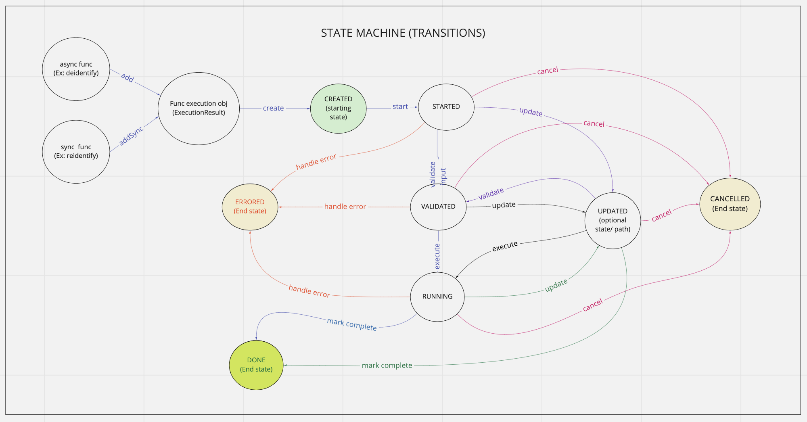

Django Turtle-Shell Usage Guide
===============================

Building App Using Turtle-shell
-------------------------------

Django turtle-shell supports asynchronous and synchronous execution of tasks. Using async with turtle-shell is easy when you want to allow long-running background tasks or update results once external systems complete.

There's an easy migration path from sync to async tasks.

First write your main functions to be run as turtle-shell executions like this.

Adding Functions To Registry
----------------------------

You can create executable functions for the app. For example:

.. code-block::

   def deidentify(sample_ids_list: Optional[str] = None,
                  flowcell_barcodes_list: Optional[str] = None,
                  deidentification_suffix: str = None,
                  flowcell_type: FlowcellType = FlowcellType.IPS):
       ...

This can be a function that needs to be executed asynchronously.

.. code-block::

   def reidentify(research_sample_ids: str,
                  send_email_to_third_party: Optional[bool] = False,
                  to_email_ids_list: Optional[str] = None,
                  flowcell_type: FlowcellType = FlowcellType.IPS):
       ...

This can be another function that needs to be executed in a synchronous fashion.

The ``_Registry`` class in turtle-shell provides the following template functionality to add such executable functions to the apps that derive from it.

In the apps that extend ``turtle_shell`` asyncronous or synchronous functions can be added as follows:

.. code-block::

    Registry = turtle_shell.get_registry()

    # Add function for new asynchronous executions
    Registry.add(deidentify)

    # Add function for new synchronous executions
    Registry.addSync(reidentify)

This will add functions ``deidentify`` and ``reidentify`` to the django app that can now be used to process requests with async or sync execution, respectively.
By adding them to the ``turtle-shell`` registry, this library converts these functions with annotations into a Django Form and optionally a graphql view. It leverages the features of defopt under the hood so that functions like this can become forms, generated from type annotations! Refer README for more details.

The ``turtle_shell`` model functions can be overridden to define app-specific implementations.

.. code-block::

    class AppExecution(turtle_shell.models.Execution):
        def get_current_state(inputs, status):
            # App specific behavior to calculate internal state of inputs (based on output from previous task),
            # the status (state)
            # and return the new internal state of inputs (or output at this stage) and new status (state)
            return current_inputs, current_status

        def _validate_inputs(inputs, func_name, status):
            # Define input validation for function executions
            # and return current state of inputs and status
            if inputs.valid():
                super()._validate_inputs(inputs, status)

        def create(**kwargs):
            # App specific behavior to start an execution
            self.inputs = self.cleaned_data(kwargs['input_json'])
            cur_inp, cur_status = super().create(self.inputs, self.status)
            return cur_inp, cur_status

        def start(**kwargs):
            # App specific behavior for starting the function execution
            self.inputs = kwargs['input']
            val_inp, val_status = super().start(inputs, status)
            return val_inp, val_status

The ``create_execution`` method is expected to validate arguments and prep data for downstream work. This should set the state to ``created``. For asynchronous functions, this can trigger queueing the executions with this state for async execution.

For any functions added, the first time the function is called as an execution, an ``ExecutionResult`` object is created. The input are stored as ``self.inputs`` on the object, and the previous return value is stored as ``self.state``.
You can also write a default function like ``get_current_state`` that simply takes inputs and state as arguments and returns a new state.

The ``get_current_state`` can call on the ``ExecutionManager`` to poll for internal state of object with the given inputs (uuid, input_json, current status etc.) and return the new state (output) and status based on the next transition.

The ``execute`` function can define the app-specific behavior for running a function. This can be triggered by the task (celery or other type) handler for asynchronous function executions.

.. code-block::

    def execute(**kwargs):
            # App specific behavior for running the function
            self.inputs = kwargs['input']
            func = self.func
            result_out, result_status = super().execute(self.inputs, func, self.status)
            return result_out, result_status

Then an optional ``update`` method like this:

.. code-block::

    def update(**kwargs):
         # App specific update functionality

The update method will take in current state and be expected to transition to next allowed state based on the status of the execution. In case of async function executions, this could update the status and intermediate outputs at each stage, if any.

You can optionally add a cancel method that would do cancel/ stop an execution that is in created or running states.

.. code-block::

    def cancel(**kwargs):
        # App specific implementation
        cancel_out, cancel_status = super().cancel(self.inputs, self.status)
        return cancel_out, cancel_status

Error handling and responses can be defined by overriding the ``handle_error_response`` function:

.. code-block::

    def handle_error_response():
        # App specific error response handling

You signal that still work to do via the ``update()`` function (dual return value?) and use ``handle_error_response()`` to signal that an error happened via exception.
If an execution fails with error due to external factors like network issues etc., then you can extend the functionality of ``execute()`` to define the behavior to ``rerun`` from the last checkpoint.

Details like input, execution states, creation/ update/ completion times, final response, intermediate stage updates or error response, if any for various functions in the app, through the ``ExecutionDetailView`` and ``ExecutionListView`` views.

Extending Turtle-shell Functionality
------------------------------------

Redefine `turtle-shell`` implementation to add executable functions with asyncronous or synchronous execution to ``_Registry`` class in turtle-shell template functionality.

.. code-block::

    def add(self, func, name=None, config=None):
        func_obj = self.get(name)
        if not func_obj:
           func_obj = _Function.from_function(func, name=name, config=config)

This adds an executable function that can be run asynchronously, which is the default mode of execution.

Functions that execute synchronously are a special case and can be added to the ``turtle-shell`` Registry using the following.

.. code-block::

    def addSync(self, func, name=None, config=None):
        func_obj = self.get(name)
        if not func_obj:
           func_obj = _Function.from_function(func, name=name, config=config)

The default state transitions defined in the django turtle-shell are:

Define these new classes:

``ExecutionValidator`` : To define input validation for function executions

``ExecutionStatus``: To define execution states, status at each stage and transitions from one to next

``Execution``: To implement functionality to create, start, execute, update or cancel executions to specific state transitions

``SyncExecutionState``  and ``SyncExecution`` can be special case implementations for synchronous function executions.

.. code-block::

    class ExecutionValidator:
        def validate_execution_input(self, uuid, func_name, input_json):
            # define validation here

    class ExecutionStatus:
        states = []
        def state_transition_filter(self, from_states, to_states):
            # Default implementation is async
            # return allowed state transitions

        def transition_state(self, uuid, from_state, to_state):
            #Change from_state to to_state for the object and save

    class SyncExecutionState(ExecutionStatus):
        def state_transition_filter(self, from_states, to_states):
           # Implementation specific to sync execution as needed

    class Execution(ExecutionValidator, ExecutionResult):
        #all fields in the model are available here
        execution_state = ExecutionState()
        def get_function(self):
            #return function object

        def create_execution(self):
            func = self.get_function()
            self.validate_execution_input()
            self.state = "CREATED"

        @ExecutionState.state_transition_filter()
        def run_execution(self):
            json_result = self.func(**self.input_json)
            self.transition_state(uuid='', from_state=self.state, to_state='next state in flow')

        @ExecutionState.state_transition_filter()
        def update_execution(self):
            json_result = self.func(**self.input_json)
            self.transition_state(uuid='', from_state=self.state, to_state='next state in flow')

        @ExecutionState.state_transition_filter()
        def cancel_execution(self):
            self.func.cancel()
            self.transition_state(uuid='', from_state=self.state, to_state='next state in flow')

    class SyncExecution(Execution):
        execution_state = SyncExecutionState()
        def execute(self):
            self.create_execution()
            self.run_execution()

        def update(self):
            self.update_execution()

Extending Views To Support Async/ Sync Function Views
-----------------------------------------------------

Redefine Views for asynchronous and synchronous function executions.

.. code-block::

    class ExecutionDetailView(ExecutionViewMixin, DetailView):
       # Implement the DetailView to show the progress of the execution

    class ExecutionListView(ExecutionViewMixin, ListView):
        def get_queryset()
            # List executions with status (Created, Running, Done, Errored, Updating etc.)
            #order executions by("-created")

    class ExecutionCreateView(ExecutionViewMixin, CreateView):
        def get_form_kwargs()
            ...
        def get_context_data()
            ...

        def form_valid():
            self.object.create_execution()
            ....

This provides views for asynchronous functions, which is the default execution mode. This can be overridden to define special case functionality for synchronous functions.

.. code-block::

    class SyncExecutionDetailView(ExecutionViewMixin, DetailView):
        pass
        #no op

    class SyncExecutionListView(ExecutionViewMixin, ListView):
        def get_queryset():
            #order executions by("-created")

    class SyncExecutionCreateView(ExecutionViewMixin, CreateView):
        def get_form_kwargs():
            ...
        def get_context_data():
            ...
        def form_valid():
            self.object.create_execution()
            self.object.execute()
            ...

Extend the functionality of the `ExecutionResult` model to define ways to create, run, update and cancel executions.

Define a manager ``ExecutionResultManager`` for managing the internal state and transitions of the execution objects.
This should be able to poll for any state changes to execution instances and do the required to return current state and status for each object when called from ``get_current_state``.
The ``ExecutionResultManager`` can be extended to define handling state transitions and polling methods for different functions.

.. code-block::

    class ExecutionResultManager(models.Manager):
        model = ExecutionResult
        inputs = {}

        def get_current_state(inputs, status):
            # Override this to define app-specific behavior
            # to calculate internal state of inputs (based on output from previous task),
            # the status and return the new internal state of inputs (or output at this stage) and new status.
            # This can be defined by apps extending this functionality.
            pass

        def handle_error_response(self, error_details):
            error_response = {}
            self.status = self.ExecutionStatus.ERRORED
            with transaction.atomic():
                self.save()

            error_response['uuid'] = self.uuid
            error_response['error_details'] = error_details
            ...
            return error_response

        def _validate_inputs(input, func_name, status):
            # Can be overridden to define app-specific input validation for function executions
            return get_current_state(inputs, status)

        def _get_inputs(uuid, input_json, status, current_state, next_state, output_json):
            return {'input_json': input_json ,
                               'uuid': uuid,
                               'status': status,
                               'current_state': current_state, # Could be None to start with
                               'next_state': next_state # Could pass next possible state
                               'output_json': output_json # None until output is ready
            }

        def create(**kwargs):
            ...
            try:
                self.func = self.get_function()
                # Here the execution instance is created, so the
                input_json = self.cleaned_data(kwargs['input_json'])
                self.inputs = _get_inputs(self.uuid, input_json, self.status, None, next_state, None)
                cur_inp, cur_status = get_current_state(self.inputs, self.status)
                self.status = cur_status # will be self.ExecutionStatus.CREATED
                with transaction.atomic():
                    self.save()
                 ...
            except CreationError as ce:
                error_details = {'error_type': ce.error_type,
                                 'error_traceback': traceback,}
                error_response = self.handle_error_response(error_details)
            return cur_inp, cur_status

        def start(**kwargs):
            ...
            self.inputs = _get_inputs(self.uuid, input_json, self.status, current_state, next_state, None)
            # Generic behavior for starting functions
            cur_inp, cur_status = get_current_state(self.inputs, self.status)
            self.status = cur_status # will be ExecutionStatus.STARTED
            try:
                val_inp, val_status = self._validate_inputs(cur_inp, self.func, cur_status)
                self.status = val_status # will be ExecutionStatus.VALIDATED
                self.save()
            except ValidationError as ve:
                error_details = {'error_type': ve.error_type,
                                 'error_traceback': traceback,}
                self.handle_error_response(ve)
            return val_inp, val_status

        def execute():
            ...
            try:
                result = original_result = func(**self.inputs)
                result = json.loads(result.json())
                self.output_json = result
                self.inputs = _get_inputs(self.uuid, input_json, self.status, current_state, EXECUTE, self.output_json)
                result_out, result_status = get_current_state(result, self.status)
                self.status = result_status # will be self.ExecutionStatus.DONE
                with transaction.atomic():
                        self.save()
            except ExecutionError as ee:
                error_details = {'error_type': ee.error_type,
                                 'error_traceback': traceback}
                error_response = self.handle_error_response(error_details)
                return error_response
            ...
            return result_out, result_status

        def cancel():
            ...
            self.inputs = _get_inputs(self.uuid, input_json, self.status, current_state, CANCEL, self.output_json)
            cancel_out, cancel_status = get_current_state(self.inputs, self.status)
            self.status = cancel_status # will be self.ExecutionStatus.CANCELLED
            with transaction.atomic():
                self.save()
            ...
            return cancel_out, cancel_status

        def update():
            ...
            self.inputs = _get_inputs(self.uuid, input_json, self.status, current_state, UPDATE, self.output_json)
            update_out, update_status = get_current_state(self.inputs, self.status)
            self.status = update_status # will be self.ExecutionStatus.UPDATED
            with transaction.atomic():
                self.save()
            ...
            return update_out, update_status